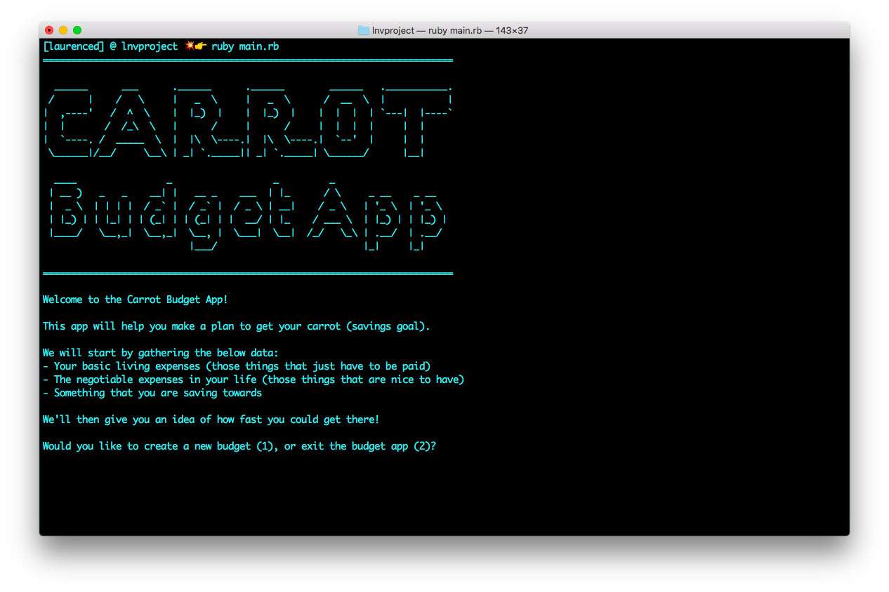
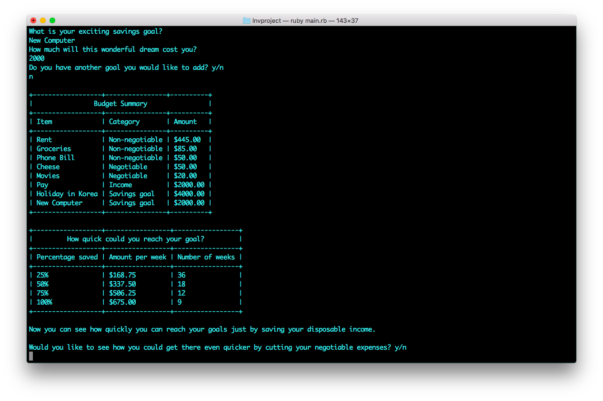
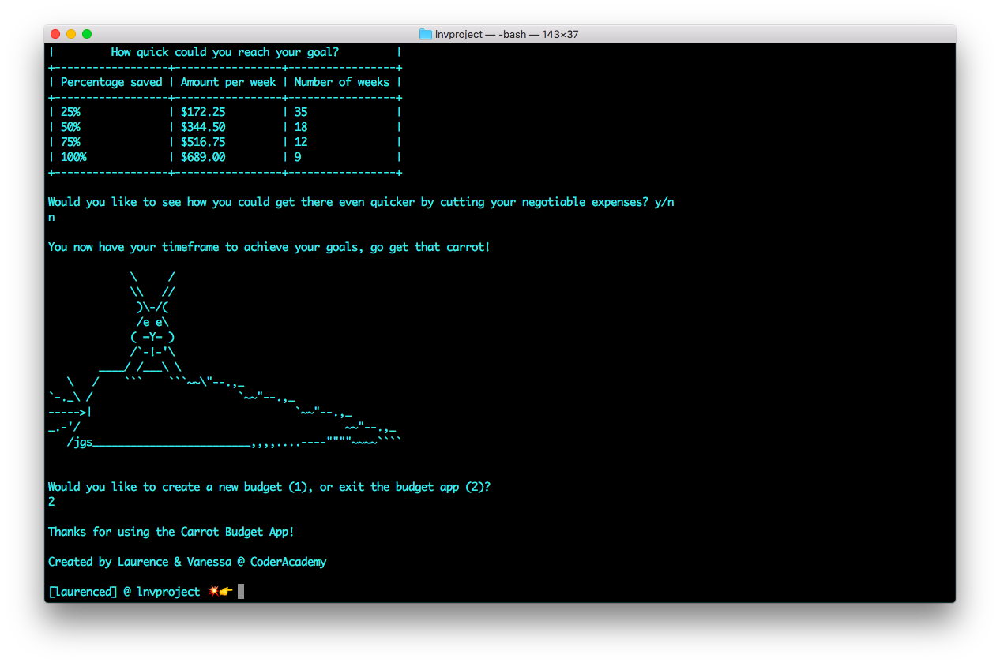
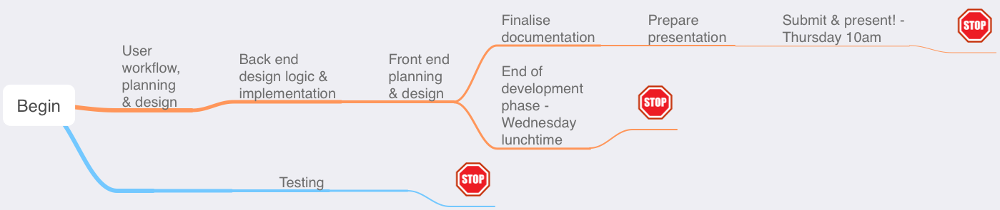

# Term 1 terminal app project

[Link to GitHub Repository](https://github.com/LDib/lnvproject)

# About the App

## Description of App
**Purpose**

The purpose of this budget app is to incentivise saving by providing a range of savings timelines and simple money management tips on the way.

**Functionality**

The Carrot Budget App asks the user for their spending data, income data and savings goals.
It then calculates 4 timelines for saving based on what percentage of the user's discretionary income they choose to save. 
It then offers the user the option to improve their timeline by cutting discretionary spending with a user-determined percentage.

If the user's income doesn't cover their discretionary spending, the app then suggests an amount per fortnight to cut from their spending. Should the user's income not cover their basic living expenses the app offers resources for financial guidance.

## Instructions For Use

**Installation**

In order to use this app you will need to install 2 gems.

The gems used in this app are:
- TTY Font
- Terminal Table

To install these gems please run these commands in your terminal.

```
$ gem install tty-font
```
```
$ gem install terminal-table
```

Run this command from the app folder in your terminal and follow the prompts.

```
$ ruby main.rb
```

## Screenshots

Here are some screen shots of the app in action.

1. Welcome page with description and instructions.



2. Summary of budget data and savings timelines.



3. Exit page and celebratory ascii art.



# Project Plan

## Brainstorming Ideas for Apps
Potential idea #1 - Vanessa suggested app that would pull weather data using API's and popular travel locations and based on weather data during the time of year that you would like to go would recommend possible locations based on historical weather data that would make your holiday more enjoyable! :)

Potential idea #2 - An app that scrapes the web and pulls inspirational quotes, presenting them to the user who could filter by category!

Potential idea #3 - An app that measures reaction time and gives a rating on your reflexes.

Potential idea #4 - An app that helps the user make a budget, based on negotiable and non-negotiable budget items and incentivises savings goals with a time reward based on improvements in spending.

Potential idea #5 - An app that takes information about your vehicle use, fuel consumption, distance travelled and tells you how efficient your vehicle is, how much it costs to run, how much you need to budget to run it and can tell you how expensive a potential trip would be.

We discussed these idea, the complexity of each one, what we were both interested in and what suited our respective strengths, and thus chose option #4!


## Brainstorming the Budget App

In discussing the budget app Laurence liked the idea of thinking about things that are non-negotiable and things that could be left out or made cheaper. Vanessa introduced the idea of incentivising the user to make improvements to their expenditure by using a carrot instead of a stick, advising the user that based on improvements would be able to meet their goal in a quicker period of time. We felt that this is a good combination as it takes in simple variables, presents simple results and combines non-judgemental ease of use and encourages people to take control of their finances!

Started by setting up our git hub repository, decided to call our app 'lnvproject' fo the timebeing.

SPECS - 

1. Inputs
- Non-negotiable expenses
- 'Making life not suck expenses'
- Pay details
- Savings goals (description, length of time it is away)

2. Outputs
- Percentage of your current pay with (amount) that needs to be put away to meet non-negotiable expenses OR if your non negotiable expenses are higher then possible range of options, and message to consider seeking professional help.
- A range of options on meeting your savings goal based on how much of your 'making life not suck expenses' you're willing to put away each time period OR a percentage of your current spending or amount that needs to reduce so you don't go into debt.

3. Stretch Goals
- Savings goal progress bar or slider 
-- SUPER STRETCH - Based on user estimate of current time it will take them to reach goal
- Connect to API's to help user find cheaper alternatives to 'making life not suck' expenses

4. Gems to use
- Terminal table for outputing budget details
- TTY gems for file handling more pleasing outputs (better user interface)

## Project Timeline



## Coding it out

Day 1 - Morning

We created our budget class and defined our attributes that the user is going to first input. Within the budget class we specified how the atrributes were going to be presented by specifying the calculations that were going to occur. In orer to keep the code tidy we created a seperate file called 'conversions' where we created a module that would specify the calculations we wanted to call on the attributes for the calculation phase and also for the presentation phase. We had to create two seperate methods for conversion to cents due to the fact that some values were stored as integers by themselves and others as integers within hashes. We used the ruby method .each to perform calculations on and replace all of the values that were stored in hashes.

Throughout all this we require_relative'd the different files that we used.

Day 1 - Afternoon

Begun work on the user interface. Wrote the micro-copy to prompt the user to enter their budget data, and used this data to create a budget object with our budget hash. Whilst working on the user interface we looked at the possibility of keeping as many calculations as possible out of the 'interface' and 'main' files. We found that keeping the code to manage the data based on user input was best kept in the 'interface' file as it would have resulted in the creation of unnecessary classes and/or modules.

Testing was performed on the code, with a prepared data set that was entered automatically instead of us having to walk through the entire app everytime to work out the bugs.

The first gem that we put into use was 'tty-table', after failing to get it working we discovered another gem called 'terminal-table' which works excellently. We pulled the user input data into another file 'displaybudget' where the presentation of the sum of the data the user has entered would be configured to appear in the table using the new gem. During this process we decided that we would like to keep the percentage recommendations based on the users saving potential to be kept in a seperate table, and have set out a new method in the 'conversions' file for this to be completed tomorrow.

The second gem that will be put in use is 'tty-font' that will have a welcome screent to greet the user when the application is launched. There is potential that we can put other styled text in various places throughout the user interface to make for a more enjoyable user experience.

Day 2 - Morning

Started early and wrote the algorithm for calculating the percentages and displaying them on the screen.

After this we checked our initial specs and realised we weren't quite done. Also realised that input number 4 was incorrectly spec'd - we didn't need to accept info about how far away the savings goals were as we were calculating how long it would be until the user had saved enough.

Came up with a method to recieve user input to decide how much of their negotiable spending to reduce. Decided to display this in a separate table rather than attempting to combine with the earlier summary.

Cleaned font and appearance and added ascii art as an exit screen.

Day 2 Afternoon

Testing, debugging and documentation.

## Project Management Tools

We used Trello to keep track of tasks. Our Trello board can be found here:

[Link to Trello Board for Carrot Budget App](https://trello.com/b/UdgwSDsg/budget-app)

Here are three representative shots, from different stages of the project.

1. Early


2. Middle


3. Late

